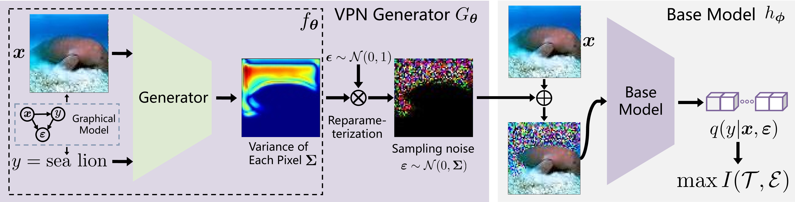

# Variational Positive-incentive Noise: How Noise Benefits Models (T-PAMI)

## Introduction
This is a [Pytorch](https://pytorch.org) implementation of **VPN**:
>   Hongyuan Zhang, Sida Huang, Yubin Guo, and Xuelong Li<sup>\*</sup>, "Variational Positive-incentive Noise: How Noise Benefits Models", IEEE Transactions on Pattern Analysis and Machine Intelligence (T-PAMI), 2025. ([arXiv](https://arxiv.org/abs/2306.07651))



## Requirements
### Installation
```bash
# Install dependencies
pip install -r requirements.txt
```


## Usage
Run the code
```bash
python train.py             \
    --dataset=DATASET       \
    --network=NETWORK       \
    --generator=GENERATOR   \
```
parameters:

DATASET: dataset name, such as **fashion-mnist**

NETWORK: the base network type, such as **resnet18**

GENERATOR: the noise generator type, such as  **dnn3**


## Contact
If you have any question about this project, please feel free to contact hyzhang98@gmail.com and sidahuang2001@gmail.com.

## Citation

If you find the code useful for your research, please consider citing our work:

```
@article{VPN,
    title={Variational Positive-incentive Noise: How Noise Benefits Models}, 
    author={Hongyuan Zhang and Sida Huang and Yubin Guo and Xuelong Li},
    year={2025},
    journal={IEEE Transactions on Pattern Analysis and Machine Intelligence},
}
```
